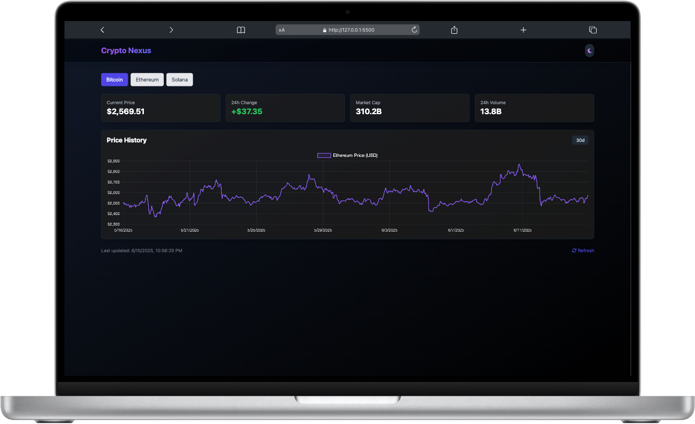

# **CryptoNexus**

## **Table of Contents**

- [Project Overview](#project-overview)
- [Features](#features)
- [Installation](#installation)
- [Usage](#usage)
- [Technologies Used](#technologies-used)
- [Screenshots](#screenshots)
- [License](#license)

## **Project Overview**

CryptoNexus is a cryptocurrency tracking application that fetches real-time data from CoinGecko API and displays it in an interactive dashboard. This application provides users with up-to-date information on various cryptocurrencies including Bitcoin, Ethereum, and Solana, helping users make informed decisions in the crypto market.

This project has evolved from a vanilla JavaScript implementation to a modern React application. The initial version was built with HTML, CSS, and JavaScript to establish core functionality and understand fundamental concepts. The current version leverages React to enhance the user interface with component-based architecture, state management, and more dynamic interactions. This evolution reflects a real-world development process where applications grow from simple prototypes to sophisticated web applications.

## **Features**

- **Real-time cryptocurrency data** fetched from CoinGecko API
- **Multiple cryptocurrency support** including Bitcoin, Ethereum, and Solana
- **Detailed cryptocurrency information** including price, market cap, and volume
- **Interactive price history charts** for tracking price movements over 30 days
- **Responsive design** for both mobile and desktop devices
- **Clean, user-friendly interface** for easy navigation
- **Dynamic data display** with DOM manipulation
- **Error handling** with mock data fallback when API is unavailable
- **Smart number formatting** for improved readability of financial data

## **Installation**

```bash
# Clone the repository
git clone https://github.com/yourusername/cryptoNexus.git

# Navigate to the project directory
cd cryptoNexus

# For the vanilla JS version
# Simply open index.html in your browser or use a local server like Live Server in VS Code

# For the React version
# Navigate to the React project directory
cd crypto-nexus

# Install dependencies
npm install

# Start the development server
npm run dev
```

## **Usage**

1. Open the application in your web browser
2. Select a cryptocurrency (Bitcoin, Ethereum, or Solana) from the top buttons
3. View real-time cryptocurrency data including price, market cap, and 24h change
4. Explore the interactive price history chart showing 30-day trends
5. Use mock data fallback when API rate limits are reached

## **Technologies Used**

### Vanilla JS Version
-  - Core programming language
-  - Structure and content
-  - Styling and responsiveness
-  - Utility-first CSS framework
-  - Interactive data visualization
-  - Cryptocurrency data source
-  - Asynchronous data fetching
-  - JavaScript code organization

### React Version
-  - Frontend library for building user interfaces
-  - Next-generation frontend tooling
-  - Utility-first CSS framework
-  - Programming language
-  - Cryptocurrency data source
-  - Interactive data visualization

## **Project Structure**

```
cryptoNexus/
├── index.html              # Main HTML file for vanilla JS version
├── script.js               # JavaScript with API calls and chart functionality
├── mockData.js             # Mock data for offline development and API fallback
├── crypto-nexus/           # React version directory
│   ├── src/
│   │   ├── components/     # React components
│   │   │   ├── Header.jsx  # App header component
│   │   │   ├── DataCards.jsx # Cryptocurrency data cards
│   │   │   └── ...         # Other components
│   │   ├── App.jsx         # Main React component
│   │   ├── App.css         # Styles for components
│   │   ├── index.css       # Global styles with Tailwind directives
│   │   └── main.jsx        # React entry point
│   ├── index.html          # HTML entry for React version
│   ├── vite.config.js      # Vite configuration
│   ├── tailwind.config.js  # Tailwind CSS configuration
│   └── package.json        # Project dependencies and scripts
└── README.md               # Project documentation
```

## **Screenshots**

|  |  |  |
| :----------------------------------------------------------------: | :--------------------------------------------------------------: | :-----------------------------------------------------------------------------------: |
|                      Crypto Nexus on Desktop                       |                      Crypto Nexus on iPhone                      |                                     Crypto Nexus                                      |

## **Future Improvements**

- Add cryptocurrency search functionality
- Implement user authentication for personalized watchlists
- Create portfolio tracking functionality
- Add detailed individual cryptocurrency pages
- Implement price alerts and notifications
- Add client-side caching to reduce API calls
- Implement dark/light mode toggle
- Add historical data comparison tools
- Create mobile app version with React Native
- Add real-time price updates with WebSockets

## **License**

This project is licensed under the MIT License - see the [LICENSE](LICENSE) file for details.

---

Made with ❤️ by Zachary
